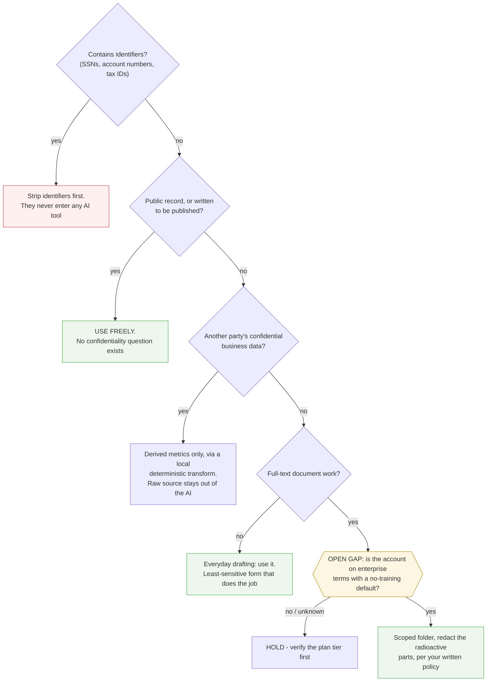

# decision-tree-skill

An [Agent Skill](https://agentskills.io) for Claude Code (and any agent tooling that reads `SKILL.md` files) that maps a recurring decision into an honest yes/no tree — and marks every question you can't answer yet as an **open gap**, so the tree doubles as a reading list.

The whole skill is one markdown file: [`SKILL.md`](SKILL.md).

## Why

AI is really powerful at taking in large amounts of information, and it's made all of us really powerful at putting out large amounts of information. What gets lost in the volume is the ability to make a decision or find a path forward. A basic yes/no decision tree is a completely obvious tool for that — and it didn't seem to exist as a skill, so here it is.

The diagram is the cheapest part. What it forces is the product:

1. **Every branch must be an observable fact, not a judgment word.** "Is the data sensitive?" is a judgment hiding as a question. Split it into things you can check.
2. **Cheapest, most decisive questions go closest to the root.** A five-second disqualifier beats a nuanced question that takes a week.
3. **Yes/no only.** A three-way fork means the question is really two questions.
4. **Any question you can't answer yet becomes a marked open gap**, with a note on what would answer it: a document to read, a person to ask, a term to verify.

A finished tree with zero gaps means you actually understand the decision. A tree with gap nodes means your overwhelm was never fog — it was specific unanswered questions, and now they're written down.

## What it looks like



That's a trimmed version of the worked example in [`examples/`](examples/2026-07-12-client-data-ai-tool.md) — the classic "can this client data enter an AI tool?" question, with the open gaps left honestly open.

## Install

Claude Code:

```bash
mkdir -p .claude/skills/decision-tree
curl -o .claude/skills/decision-tree/SKILL.md https://raw.githubusercontent.com/ajpaschka/decision-tree-skill/main/SKILL.md
```

Then: `/decision-tree can this client data enter an AI tool?`

Any other agent that reads `SKILL.md` files: same file, wherever your tooling expects skills to live.

Trees render natively on GitHub. In VS Code, add a Mermaid preview extension.

## Contributing

This is a prototype and an effort to move things forward, not a finished product. If you can improve it — sharper forcing questions, better gap conventions, a worked example from your own domain — open a PR or an issue. Improved trees are as welcome as improved skill text.

## License

[MIT](LICENSE)
