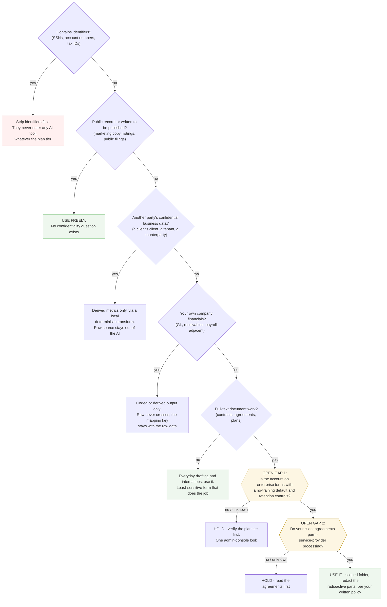

# Decision: Can this client data enter an AI tool?
**Made for:** anyone at the firm, day to day · **Reversibility:** reversible per-task, but data that has already crossed can't be un-shared — so branches err protective
**Mapped:** 2026-07-12 · **Status:** 2 open gaps

A worked example of the skill's output. The scenario is generic (a services firm handling client documents and financials); the open gaps are left honestly open because that's the point — they're the reading list.

## Open gaps

| # | Node | What would answer it | Where |
|---|---|---|---|
| 1 | Enterprise terms + no-training default | One admin-console look at what plan the accounts are actually on, then the vendor's commercial terms | Vendor admin console + terms page |
| 2 | Client-agreement confidentiality clauses | Reading the actual agreements: do they permit service-provider processing, or require consent or carve-outs? | Your engagement letters / MSAs / operating agreements |

## Notes

- The easy cases are genuinely easy: anything written to be published exits at question two without touching a gap. If your tree can't produce a fast answer for the easy case, the branches aren't observable enough yet.
- Closing the gaps doesn't open the floodgates: company financials stay at coded-or-derived even on fully verified enterprise terms. The gaps only gate the full-text document lane.
- What this tree deliberately doesn't decide: which vendor. That's a different tree.
